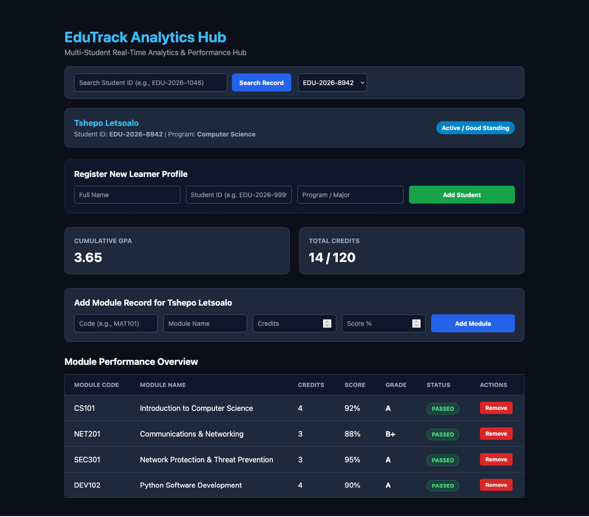
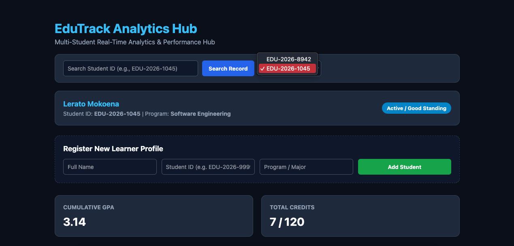
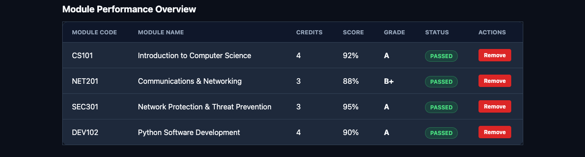

# EduTrack Analytics Hub 🎓

> **Geekulcha Annual Hackathon 2026** | *Challenge: Education Self-sufficiency (Localised Self-Learning Experiences)*

[]()
[](https://www.python.org/)
[](https://flask.palletsprojects.com/)
[](https://opensource.org/licenses/MIT)

A centralized, secure multi-student web application designed to manage, format, and visualize student academic performance metrics, dynamic GPA tracking, and automated grade validations in real time. Built with an emphasis on low-bandwidth efficiency, robust security, and a seamless user experience (UX) to satisfy the **"BUILD FOR USE"** mandate.

---

## 📸 Visual Workflow & Features

### 📊 Unified Academic Dashboard

* **Context:** The core operational hub displaying real-time academic metrics, active learner profile details, dynamic GPA calculations, and structured module performance records at a glance.

### 🔍 Multi-Student Search & Switcher

* **Context:** Demonstrates the system's scalability beyond a single-student tracker. Evaluators and administrators can instantly search by Student ID or use the dropdown switcher to manage multiple student records dynamically.

### 📋 Module Performance & Status Tracking

* **Context:** Shows detailed transcript rows featuring module codes, names, earned credits, scores, letter grades, and automated color-coded status badges (`PASSED`) alongside interactive CRUD management tools.

---

## 🌟 Core Features

* **Multi-Student Management:** Register multiple learner profiles, search records instantly by Student ID, and seamlessly switch between student accounts.
* **Automated Grade Calculations:** Real-time GPA, letter grading, and modular score tracking to eliminate manual calculation errors.
* **Structured Report Generation:** Instant generation of verified summary cards and progress transcripts.
* **Low-Bandwidth Optimized:** Lightweight interface tailored for accessibility across regional networks and local hardware.

---

## 🛡️ Security & Architecture (SSDLC)

Designed with a **Secure Software Development Lifecycle (SSDLC)** mindset for real-world deployment trust:
* **Security-by-Design:** Strict input validation and parameterized routes to prevent injection vulnerabilities.
* **Data Integrity:** Enforced session management and secure routing for data protection.
* **Modular Codebase:** Clean separation of concerns between application logic (`/app`), automated tests (`/tests`), and runtime dependencies.

---

## 🛠️ Tech Stack

* **Backend:** Python, Flask (Routing, Dynamic Ingestion, Multi-Student State Handling)
* **Frontend:** HTML5, CSS3, Custom Responsive UI Components
* **Version Control:** Git & GitHub

---

## 🚀 Getting Started

### Prerequisites
* Python 3.10+
* Git

### Installation & Local Setup

1. **Clone the repository:**
   ```bash
   git clone [https://github.com/Tshepo-Letsoalo/edutrack-analytics-hub.git](https://github.com/Tshepo-Letsoalo/edutrack-analytics-hub.git)
   cd edutrack-analytics-hub


---


