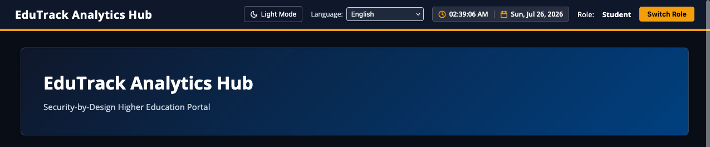
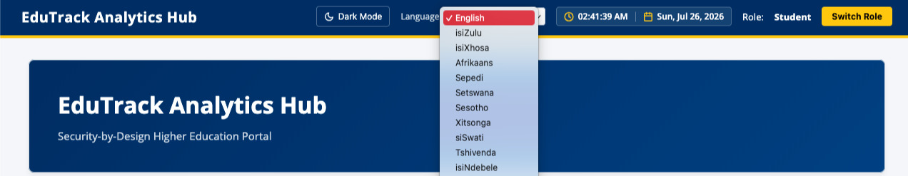
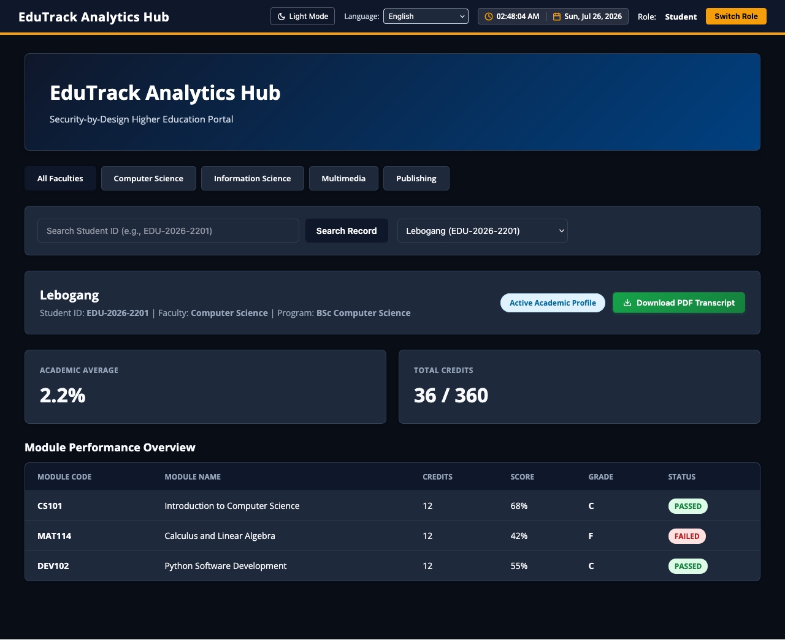
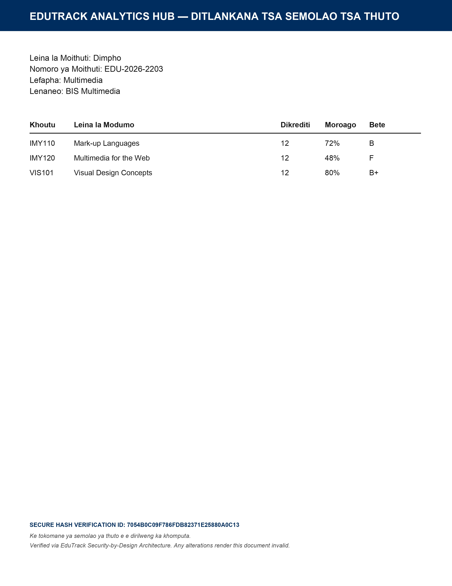

# EduTrack Analytics Hub 🎓

> **Centres for Academic Excellence 2026 | Challenge 3: Seamless Multi-Currency & Multi-Language Higher Education Portal**

[](https://www.python.org/)
[](https://flask.palletsprojects.com/)
[](LICENSE)
[]()

A centralized, secure, multi-student web application designed to maintain records, automate academic grade tracking, monitor dynamic data metrics, and provide localized interactions across higher education institutions. Built with a focus on security-by-design principles, robust routing, and localized multi-language UI support for South African communities.

---

## 🌍 Visual Workflow & Features

### 1. Header, Live Clock & Multi-Language Selector
* Features a real-time live clock, date tracker, theme toggling, and an inclusive multi-language selector supporting all 11 official South African languages plus SASL.



*(Expanded view showcasing the localized language options)*


### 2. Unified Academic Dashboard
* Centralizes core operational tabs, displaying student metrics, active performance data, dynamic calculations, and structured module performance records in real time.



### 3. Localized Transcript Export
* Generates clean, secure-hashed official PDF transcripts complete with localized headers and verification tokens.



---

## 📋 Extended System Architecture & Workflow

### Multi-Language Internationalization (i18n) Dictionary
The application implements an extensive localization dictionary mapping core institutional terms across South African linguistic demographics:
* **Nguni Group:** isiZulu, isiXhosa, isiNdebele, siSwati.
* **Sotho-Tswana Group:** Sepedi, Sesotho, Setswana.
* **Tswa-Ronga & Venda Groups:** Xitsonga, Tshivenda.
* **Other Official & Inclusive Formats:** Afrikaans, English, and South African Sign Language (SASL) metadata tags.

### Academic Rules & Calculation Logic
* **Average & Percentage Computation:** Automatically weighs course credit values against final percentage marks to output accurate semester and cumulative academic averages.
* **Status Enforcement:** Threshold rules automatically evaluate passing criteria (e.g., standard module pass marks vs. supplementary exam thresholds).
* **Cryptographic Hashing:** Transcripts generated via the engine incorporate unique verification hashes (SHA-backed identification tags) to prevent credential tampering.

---

## 🚀 Core Features

* **Multi-Student Management:** Easily manage multiple learner profiles, search records instantly by Student ID, and seamlessly switch between student accounts.
* **Automated Grade Calculations:** Real-time percentage marks, modular scores, and weighted average tracking to eliminate manual calculation errors.
* **Streamlined Report Generation:** Generate and download a number of verified academic transcripts and progress reports.
* **Low-Bandwidth Optimized:** Lightweight stateless backend for accessibility, speed, and low-resource server hardware.

---

## 🔒 Security & Architecture (SSDLC)

Designed with a Security-by-Design Software Development Lifecycle (SSDLC) ideal for academic deployment that:
* **Proactive Protection:** Implements input validation and sanitized payloads to prevent injection vulnerabilities.
* **Data Integrity:** Validates session management and secure routing for strict-role profiles.
* **Modular Control:** Clears a number of concerns between application logic, templating layers, route guards, and persistence models.

---

## 🛠️ Tech Stack

* **Backend / Python:** Flask routing, dynamic ingestion, structured state handling.
* **Frontend:** HTML5, CSS3, Custom Response UI Components.
* **Version Control:** Git & GitHub.

---

## 🏁 Getting Started

### Prerequisites
* Python 3.10+
* Git


## 👥 Contributors

| Name | Role |
|------|------|
| Tshepo | Lead Developer |
| Leonard | UI/UX Designer |
| Muziwenkosi | Data Analyst |


---

## ⚙️ Getting Started

### 🧩 Prerequisites
- Python 3.10+

### 💻 Installation & Local Setup
```bash
# Clone the repository
git clone https://github.com/edutrack-hub/edutrack-analytics-hub
cd edutrack-analytics-hub

# Create and activate a virtual environment
python -m venv venv
# On Windows:
venv\Scripts\activate
# On macOS/Linux:
source venv/bin/activate

# Install dependencies
pip install flask

# Run the application
python app.py

After starting the server, open http://127.0.0.1:5000 in your browser.
